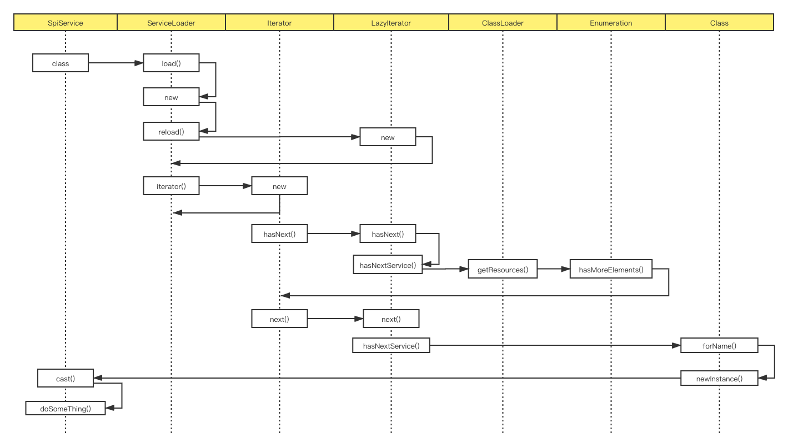

p面试问到这个，没有看过，现在分析一下

spi 全称为 Service Provider Interface，是一种服务发现机制。它通过在ClassPath路径下的META-INF/services文件夹查找文件，自动加载文件里所定义的类。 

```java
----------------------------------SpiService.class 文件内容----------------------------------------------
package com.xiaospace.jytest.spi;

public interface SpiService {
    public void doSomeThing();
}

package com.xiaospace.jytest.spi;
----------------------------------SpiService1Impl.class 文件内容----------------------------------------------
public class SpiService1Impl implements SpiService {

    @Override
    public void doSomeThing() {
        System.out.println("SpiService1Impl.doSomeThing()");
    }
}
----------------------------------SpiService2Impl.class 文件内容----------------------------------------------
package com.xiaospace.jytest.spi;

public class SpiService2Impl implements SpiService{

    @Override
    public void doSomeThing() {
        System.out.println("SpiService2Impl.doSomeThing()");
    }
}
---------------------------------------TestSpi.class 文件内容-----------------------------------------
package com.xiaospace.jytest.spi;

import sun.misc.Service;

import java.util.Iterator;
import java.util.ServiceLoader;

public class TestSpi {
    public static void main(String[] args) {
        Iterator<SpiService> providers = Service.providers(SpiService.class);
        while (providers.hasNext()){
            SpiService next = providers.next();
            next.doSomeThing();
        }

        ServiceLoader<SpiService> load = ServiceLoader.load(SpiService.class);
        Iterator<SpiService> iterator = load.iterator();
        while(iterator.hasNext()){
            SpiService next = iterator.next();
            next.doSomeThing();
        }
    }
}

---------------------------META-INF/services/com.xiaospace.jytest.spi.SpiService 文件内容------------------
com.xiaospace.jytest.spi.SpiService1Impl
com.xiaospace.jytest.spi.SpiService2Impl
```


了解一下核心代码

```java
Class<?> aClass = Class.forName("com.xiaospace.jytest.spi.SpiService1Impl");
SpiService cast = SpiService.class.cast(aClass.newInstance());
cast.doSomeThing();
```

通过Class.forName，找到相关的类 加载，实例化，并且用他的父类强转，就是spi的核心代码


查看整体流程



---

[深入理解SPI机制](https://www.jianshu.com/p/3a3edbcd8f24)