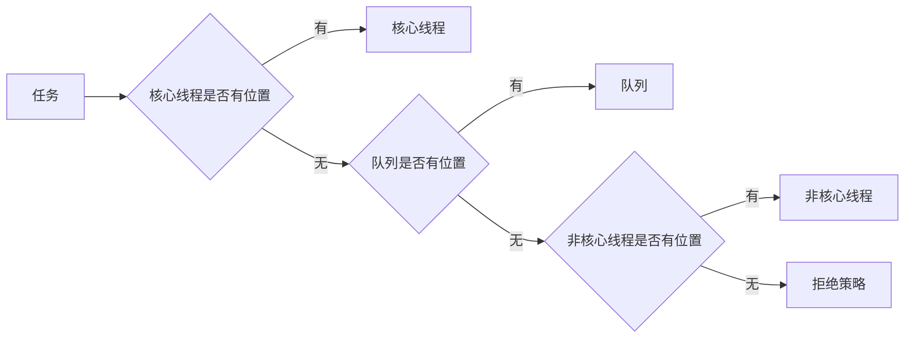

在日常开发中肯定会用到线程池来处理事情，其实线程池化已经在我们使用框架里面存在于各种地方，例如数据库的连接池，mqtt多线程处理等等都会用到线程池的概念；

先来回顾一下日常写demo的时候用到最多的Executors

Executors

* 单例的线程池

```java
ExecutorService singleThreadExecutor = Executors.newSingleThreadExecutor();
```

* 无限大的线程池

```java
ExecutorService cachedThreadPool = Executors.newCachedThreadPool();
```

* 有限的线程池

```java
ExecutorService fixedThreadPool = Executors.newFixedThreadPool(3);
```

* 可以设置等待时间的线程池

```java
ScheduledExecutorService scheduledThreadPool = Executors.newScheduledThreadPool(5);
scheduledThreadPool.schedule(new Runnable() {
 public void run() {
 System.out.println("delay 3 seconds");
 }
   }, 3, TimeUnit.SECONDS);
  }
 }
```

* 可以设置循环时间，等待时间的线程池

```java
ScheduledExecutorService scheduledThreadPool = Executors.newScheduledThreadPool(5);
   scheduledThreadPool.scheduleAtFixedRate(new Runnable() {
    public void run() {
     System.out.println("delay 1 seconds, and excute every 3 seconds");
    }
  }, 1, 3, TimeUnit.SECONDS);    
 }
}
```

---

在阿里巴巴开发规范当中不准使用Executors 来快速创建线程，一定有人会问了这个是为什么？

我们可以先来看看具体实现类ThreadPoolExecutor

```java
        ThreadPoolExecutor threadPoolExecutor = new ThreadPoolExecutor(
                2,//核心线程数
                3,//最大线程数
                1,//非核心线程数最大存活时间
                TimeUnit.SECONDS,//非核心线程数最大存活时间单位
                new LinkedBlockingQueue<>(10),//等待队列
                springThreadFactory,//创建线程的工厂，一般是为了命名的
                new ThreadPoolExecutor.AbortPolicy());//拒绝策略
```

ThreadPoolExecutor有7个核心参数

1. 核心线程数：一定存活的线程
2. 最大线程数：当核心线程数满了，以及等待队列满了以后会占用最大线程数使用
3. 非核心线程数最大存活的时间：非核心线程处理完事情后多久开始关闭
4. 非核心线程数最大存活时间单位：同上是一个单位选项
5. 等待队列：核心队列满了以后，还需要处理数据就存在等待队列里面
   1. SynchronousQueue：直接使用的队列，也就是没有等待队列直接往核心线程和最大线程里面执行
   2. LinkedBlockingQueue：无限长度的队列，其实也是可以指定队列长度的
   3. ArrayBlockingQueue：有限长度的队列
6. 线程工厂：创建线程，一般就是为了命名线程使用的
7. 拒绝策略：四种拒绝策略

   1. AbortPolicy：当处理不过来后抛错也是默认策略
   2. DiscardPolicy：不处理也不报错直接丢失
   3. DiscardOldestPolicy：把老的直接丢弃把新的放进来
   4. CallerRunsPolicy：直接开始调用
   5. 可以自定义处理实现RejectedExecutionHandler

面试问题：线程池的工作流程

主要考点就是上面参数详解中的 非核心线程 什么时候开始被执行，任务进来后 先判断核心线程是否存在空闲可以直接使用，然后判断队列是否有空闲可以插入，然后判断非核心线程是不是可以使用 

流程图


尝试另外一种风格的流程图
```flow
st=>start: 任务
core_place=>condition: 核心线程是否有位置
queue_place=>condition: 队列是否有位置
non_core_place=>condition: 非核心线程是否有位置
core=>operation: 核心线程
queue=>operation: 队列
non_core=>operation: 非核心线程
policy=>operation: 拒绝策略
st->core_place
core_place(yes)->core
core_place(no)->queue_place
queue_place(yes)->queue
queue_place(no)->non_core_place
non_core_place(yes)->non_core
non_core_place(no)->policy

```


讲一下代码层面验证和源码层面

代码验证

```java
public static void main(String[] args) {
        ThreadFactory springThreadFactory = new CustomizableThreadFactory("springThread-pool-");
        ThreadPoolExecutor threadPoolExecutor = new ThreadPoolExecutor(
                2,//核心线程数
                3,//最大线程数
                1,//非核心线程数最大存活时间
                TimeUnit.SECONDS,//非核心线程数最大存活时间单位
                new LinkedBlockingQueue<>(9),//等待队列
                springThreadFactory,//创建线程的工厂，一般是为了命名的
                new ThreadPoolExecutor.AbortPolicy());//拒绝策略
        ScheduledExecutorService scheduledThreadPool = Executors.newScheduledThreadPool(5);
        for (int i = 0; i < 12; i++) {
            int finalI = i;
            threadPoolExecutor.execute(() -> {
                System.out.println(Thread.currentThread().getName() + ":" + finalI);
                try {
                    Thread.sleep(1000l);
                } catch (InterruptedException e) {
                    e.printStackTrace();
                }
            });
        }
    }
```

控制台

```console
springThread-pool-2:1
springThread-pool-3:11
springThread-pool-1:0
springThread-pool-2:2
springThread-pool-3:3
springThread-pool-1:4
springThread-pool-3:5
springThread-pool-2:7
springThread-pool-1:6
springThread-pool-3:8
springThread-pool-2:10
springThread-pool-1:9
```

源码

```java
        int c = ctl.get();
        if (workerCountOf(c) < corePoolSize) {//小于核心线程就加入
            if (addWorker(command, true))//加入成功判断
                return;
            c = ctl.get();
        }
        if (isRunning(c) && workQueue.offer(command)) {//再插入队列
            int recheck = ctl.get();
            if (! isRunning(recheck) && remove(command))
                reject(command);
            else if (workerCountOf(recheck) == 0)
                addWorker(null, false);
        }
        else if (!addWorker(command, false))//再插入非核心线程
            reject(command);
```

---

一个个讲为什么阿里不让使用快捷的线程池

* 单例线程池

```java
    public static ExecutorService newSingleThreadExecutor() {
        return new FinalizableDelegatedExecutorService
            (new ThreadPoolExecutor(1, 1,
                                    0L, TimeUnit.MILLISECONDS,
                                    new LinkedBlockingQueue<Runnable>()));
    }
```

LinkedBlockingQueue 没有限制大小，会导致有内存溢出的风险

* 无限大的线程池

```java
    public static ExecutorService newCachedThreadPool() {
        return new ThreadPoolExecutor(0, Integer.MAX_VALUE,
                                      60L, TimeUnit.SECONDS,
                                      new SynchronousQueue<Runnable>());
    }
```

SynchronousQueue 没有问题，但是最大线程数没有限制大小，容易导致线程创建过多，导致直接机器卡死崩溃

* 有限的线程池

```java
    public static ExecutorService newFixedThreadPool(int nThreads) {
        return new ThreadPoolExecutor(nThreads, nThreads,
                                      0L, TimeUnit.MILLISECONDS,
                                      new LinkedBlockingQueue<Runnable>());
    }
```

和 **单例线程池** 同样的问题是因为LinkedBlockingQueue 没有限制大小

* 设置等待时间的队列、设置等待时间的队列

```java
    public ScheduledThreadPoolExecutor(int corePoolSize) {
        super(corePoolSize, Integer.MAX_VALUE, 0, NANOSECONDS,
              new DelayedWorkQueue());
    }
```

和 **无限大的线程池** 一样的问题，最大线程数没有限制


