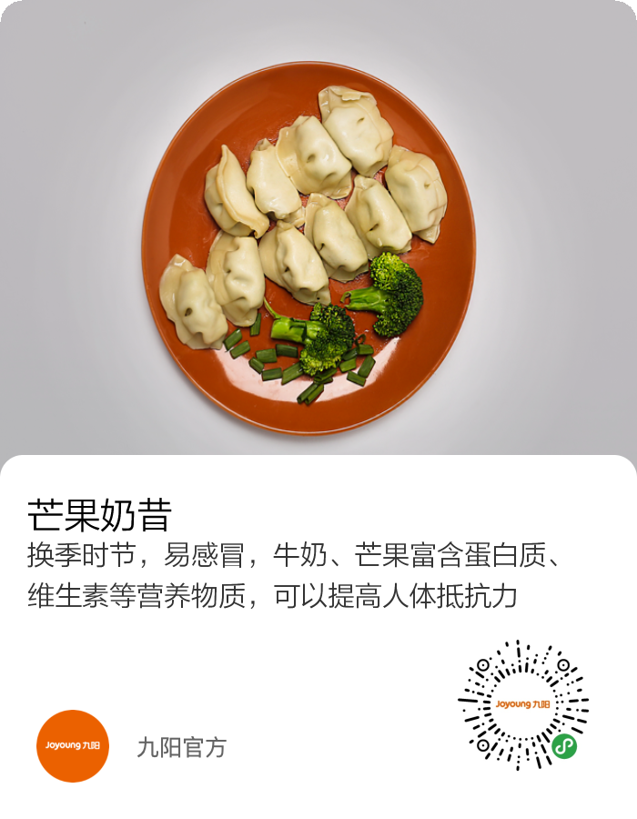

## 动态生成活动图片

[项目地址](https://github.com/xiaospace1028/poster)

---
##### 输入模版json
[json-model.md](json-model.md) 

##### 产生图片


---

#### Json解析

| 字段key      | 类型    | 是否非空                       | 默认值 | 说明     | 示例 |
| ------------ | ------- | ------------------------------ | ------ | -------- | ---- |
| images       | Arrays  | 否(默认) / 是(imageBlocks存在) | -      | 图片池   | -    |
| imageBlocks  | Arrays  | 否                             | -      | 图片组成 | -    |
| areaBlocks   | Arrays  | 否                             | -      | 底板组成 | -    |
| fontBlocks   | Arrays  | 否                             | -      | 字体组成 | -    |
| posterBlocks | Arrays  | 否                             | -      | 海报组成 | -    |
| width        | Integer | 是                             | -      | 宽       | 700  |
| height       | Integer | 是                             | -      | 高       | 900  |
| radius       | Object  | 否                             | -      | 圆角属性 | -    |

##### images图片池

```json
[
    {
        "code":"jiuyang",
        "targetUrl":"/Users/xiaospace/Downloads/Joyoung-new.png",
        "targetType":"local"
    },
    {
        "code":"jiuyang",
        "targetUrl":"https://ai-cdn.joyoung.com/ia/poster/Joyoung-new.png",
        "targetType":"web"
    }
]
```


| 字段key    | 类型   | 是否非空 | 默认值 | 说明                             | 示例                                                 |
| ---------- | ------ | -------- | ------ | -------------------------------- | ---------------------------------------------------- |
| code       | String | 是       | -      | 图片code                         | jiuyang                                              |
| targetUrl  | String | 是       | -      | 图片url                          | https://ai-cdn.joyoung.com/ia/poster/Joyoung-new.png |
| targetType | Enum   | 是       | -      | 图片类型(local：本地、web：网址) | web/local                                            |

---

##### Blocks基础属性

```json
{
    "x":40,
    "y":780,
    "width":80,
    "height":80,
    "z":-2,
    "sort":1,
    "remark":"备注",
    "color":-10197916,
    "radius":{
        "arcW":100,
        "arcY":100,
        "arc":100
    }
}
```

| 字段key      | 类型    | 是否非空                       | 默认值 | 说明     | 示例 |
| ------------ | ------- | ------------------------------ | ------ | -------- | ---- |
| x | Integer | 否 | - | 画图的起点横坐标 | 0 |
| y | Integer | 否 | - | 画图的起点纵坐标 | 0 |
| width | Integer | 是 | - | 宽度 | 10 |
| height | Integer | 是 | - | 高度 | 10 |
| z | Integer | 否 | - | 层级 | -1 |
| sort | Integer | 否 | - | 排序 | -1 |
| remark | String | 否 | - | 备注 | 0 |
| color | Integer | 否 | - | 画笔颜色 | -1 |
| radius | Object | 否 | - | 圆角属性 | - |

---

Radius属性

```json
{
    "arcW":100,
    "arcY":100,
    "arc":100
}
```

| 字段key      | 类型    | 是否非空                       | 默认值 | 说明     | 示例 |
| ------------ | ------- | ------------------------------ | ------ | -------- | ---- |
| arcW | Integer | 否 | - | 圆角width值 | 10 |
| arcY | Integer | 否 | - | 圆角height值 | 10 |
| arc | Integer | 否 | - | 圆角值(默认值，上面两个存在时候这个不生效) | 10 |
