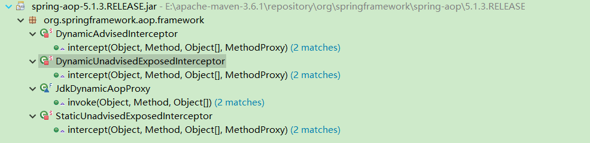

遇到一个问题

被代理的类 调用自己加了注解的方法（public,protected,private）的时候不会走代理

## 上代码

注解类

```java
@Target({ ElementType.METHOD })
@Retention(RetentionPolicy.RUNTIME)
public @interface ExecutionTime {
	String value() default "";
}
```

代理处理类

```java

@Aspect
@Component
public class ExeutionTimeAspect {
	@Around("@annotation(executionTime)")
	public void trackingTimeAdvice(ProceedingJoinPoint joinPoint, ExecutionTime executionTime) throws Throwable {
		long start = System.currentTimeMillis();
		joinPoint.proceed();
		long end = System.currentTimeMillis();
		long ex = (end - start);
		if (ex > 200) {
			StringBuffer sb = new StringBuffer("\r\n");
			String methodName = joinPoint.getSignature().toLongString();
			sb.append("请求方法名称：" + methodName);
			sb.append("\r\n");
			sb.append("请求方法中文：" + executionTime.value());
			sb.append("\r\n");
			sb.append("方法执行时间：" + ex);
			sb.append("\r\n");
			Object[] args = joinPoint.getArgs();
			if (args.length > 0) {
				sb.append("请求方法参数：");
				for (int i = 0; i < args.length; i++) {
					sb.append("\r\n");
					Object object = args[i];
					sb.append("【" + (i + 1) + "】:");
					sb.append(object.toString());
				}
				sb.append("\r\n");
			}
			System.out.println(sb.toString());
		}
	}
}
```

被代理的类

```java
@Service
public class TestService {
	@ExecutionTime("发送方法1")
	public void send1(String ss, String... sss) {
		send2(ss, sss);
	}
	@ExecutionTime("发送方法2")
	public void send2(String ss, String... sss) {
		try {
			Thread.sleep(1000);
		} catch (InterruptedException e) {
			e.printStackTrace();
		}
	}
}
```

log日志

```log
请求方法名称：public transient void com.xiaospace.jytest.service.TestService.send1(java.lang.String,java.lang.String[])
请求方法中文：推送方法1
方法执行时间：1007
请求方法参数：
【1】:111
【2】:[Ljava.lang.String;@52a33611
```

---

## 问题一：我们不能看到send2的日志

### 原因：

调用方法走的是调用者本身，没有走到代理的执行类上面。

解决办法：

```java
AopContext.currentProxy()
```

启动类加上：

```java
@EnableAspectJAutoProxy(proxyTargetClass = true, exposeProxy = true)
```

### 修改后的代码

被代理的类

```java
@Service
public class TestService {
	@ExecutionTime("发送方法1")
	public void send1(String ss, String... sss) {
		((TestService)AopContext.currentProxy()).send2(ss, sss);
	}
	@ExecutionTime("发送方法2")
	public void send2(String ss, String... sss) {
		((TestService)AopContext.currentProxy()).send3(ss, sss);	
	}
	@ExecutionTime("发送方法3")
	protected void send3(String ss, String... sss) {
		((TestService)AopContext.currentProxy()).send4(ss, sss);
	}
	@ExecutionTime("发送方法4")
	private void send4(String ss, String... sss) {
		try {
			Thread.sleep(1000);
		} catch (InterruptedException e) {
			e.printStackTrace();
		}
	}
}
```

日志

```log
请求方法名称：protected transient void com.xiaospace.jytest.service.TestService.send3(java.lang.String,java.lang.String[])
请求方法中文：推送方法3
方法执行时间：1001
请求方法参数：
【1】:111
【2】:[Ljava.lang.String;@4e26bb9f
-----------------------------------------------------------------------------------
请求方法名称：public transient void com.xiaospace.jytest.service.TestService.send2(java.lang.String,java.lang.String[])
请求方法中文：推送方法2
方法执行时间：1003
请求方法参数：
【1】:111
【2】:[Ljava.lang.String;@4e26bb9f
-----------------------------------------------------------------------------------
请求方法名称：public transient void com.xiaospace.jytest.service.TestService.send1(java.lang.String,java.lang.String[])
请求方法中文：推送方法1
方法执行时间：1009
请求方法参数：
【1】:111
【2】:[Ljava.lang.String;@4e26bb9f
------------------------------------------------------------------------------------
```

---

## 问题二：我们不能看到私有方法（send4）的日志

### 开始分析

```markdown
Spring的代理实现有两种：
1、基于 JDK Dynamic Proxy 技术而实现的；
2、基于 CGLIB 技术而实现的。
```

### CGLIB  是什么？

改代码

```java
	protected void send3(String ss, String... sss) {
		((TestService)AopContext.currentProxy()).send4(ss, sss);
	}	
	@ExecutionTime("发送方法4")
	private void send4(String ss, String... sss) {
 *		Object currentProxy = AopContext.currentProxy();
		try {
			Thread.sleep(1000);
		} catch (InterruptedException e) {
			e.printStackTrace();
		}
	}
```

在 * 号处 debug看到的currentProxy（产生的想法和问题）:

* DynamicAdvisedInterceptor：看到methodCache里面存在四个方法已经没有私有化方法（猜测是拿不到）也就是这里面放的是可能代理的方法，
* StaticUnadvisedExposedInterceptor：指的是代理的类也就是TestService
* SerializableNoOp：看起来是一个序列化的东西
* StaticDispatcher：这里面放着还是TestService
* AdvisedDispatcher：推荐的？（不懂）methodCache里面的也是四个方法
* EqualsInterceptor：这个应该是和@ExeutionTime注解比较过，因为methodCache里面少了一个没有注解的send3
* HashCodeInterceptor：这个拿来校验是不是改变的 CAS机制？

带着疑问来查看AopContext：

```java
// DOC 翻译 大致是不推荐用，会降低性能
public final class AopContext {
	@Nullable
	static Object setCurrentProxy(@Nullable Object proxy) {
		Object old = currentProxy.get();
		if (proxy != null) {
			currentProxy.set(proxy);
		}
		else {
			currentProxy.remove();
		}
		return old;
	}
}
```

查看setCurrentProxy调用地方：



看到 DynamicAdvisedInterceptor 、StaticUnadvisedExposedInterceptor 是不是很熟悉？上面出现过。

随意从一个类里面点进去查看引用的地方发现

```java
private Callback[] getCallbacks(Class<?> rootClass) throws Exception {
    ...
        
		Callback[] mainCallbacks = new Callback[] {
				aopInterceptor,  // for normal advice
				targetInterceptor,  // invoke target without considering advice, if optimized
				new SerializableNoOp(),  // no override for methods mapped to this
				targetDispatcher, this.advisedDispatcher,
				new EqualsInterceptor(this.advised),
				new HashCodeInterceptor(this.advised)
		};
    
    ...
		return callbacks;
	}
```
查看返回这些地方分析

* DynamicAdvisedInterceptor：aopInterceptor 通用AOP回调。 当目标是动态的或代理未冻结时使用。（还是有疑问，说的是什么？）
* StaticUnadvisedExposedInterceptor：targetInterceptor 

```java
Callback targetInterceptor;
		if (exposeProxy) { 
            argetInterceptor = (isStatic ?
					new StaticUnadvisedExposedInterceptor(this.advised.getTargetSource().getTarget()) :
					new DynamicUnadvisedExposedInterceptor(this.advised.getTargetSource()));
		}
		else {
			targetInterceptor = (isStatic ?
					new StaticUnadvisedInterceptor(this.advised.getTargetSource().getTarget()) :
					new DynamicUnadvisedInterceptor(this.advised.getTargetSource()));
		}
```

为什么有 exposeProxy 和 isStatic 这个两个判断值？

* SerializableNoOp：看起来是一个序列化的东西
* StaticDispatcher：静态目标的分派器。 调度程序比拦截器快得多。 只要确定方法绝对不返回“ this”，就会使用此方法
* AdvisedDispatcher：处理任何的代理类上的方法
* EqualsInterceptor：这个就是证实上面的想法
* HashCodeInterceptor：hashCode方法的调度程序。确保方法调用始终由此类处理。确定是不是他。

### 分析 核心 CglibAopProxy

上述方法中一直提到一个对象 ProxyFactory(this.advised)  AdvisedSupport

查看CglibAopProxy 构造方法

```java
	public CglibAopProxy(AdvisedSupport config) throws AopConfigException {
		Assert.notNull(config, "AdvisedSupport must not be null");
		if (config.getAdvisors().length == 0 && config.getTargetSource() == AdvisedSupport.EMPTY_TARGET_SOURCE) {
			throw new AopConfigException("No advisors and no TargetSource specified");
		}
		this.advised = config;
		this.advisedDispatcher = new AdvisedDispatcher(this.advised);
	}
```

然后查看引用地点--->DefaultAopProxyFactory

---

### DefaultAopProxyFactory

```java
public class DefaultAopProxyFactory implements AopProxyFactory, Serializable {
	@Override
	public AopProxy createAopProxy(AdvisedSupport config) throws AopConfigException {
		if (config.isOptimize() || config.isProxyTargetClass() || hasNoUserSuppliedProxyInterfaces(config)) {
			Class<?> targetClass = config.getTargetClass();
			if (targetClass == null) {
				throw new AopConfigException("TargetSource cannot determine target class: " +
						"Either an interface or a target is required for proxy creation.");
			}
			if (targetClass.isInterface() || Proxy.isProxyClass(targetClass)) {
				return new JdkDynamicAopProxy(config);
			}
			return new ObjenesisCglibAopProxy(config);
		}
		else {
			return new JdkDynamicAopProxy(config);
		}
	}
	/**
	 * Determine whether the supplied {@link AdvisedSupport} has only the
	 * {@link org.springframework.aop.SpringProxy} interface specified
	 * (or no proxy interfaces specified at all).
	 */
	private boolean hasNoUserSuppliedProxyInterfaces(AdvisedSupport config) {
		Class<?>[] ifcs = config.getProxiedInterfaces();
		return (ifcs.length == 0 || (ifcs.length == 1 && SpringProxy.class.isAssignableFrom(ifcs[0])));
	}
}
```

由上面方法可以很直观的看出怎么选择的方式

回到问题二我们为什么不能看到私有方法 也就是这个 **MethodInterceptor** 关键的类：打开cglib

```java
  private static void getMethods(Class superclass, Class[] interfaces, List methods, List interfaceMethods, Set forcePublic)
    {
        ReflectUtils.addAllMethods(superclass, methods);
        List target = (interfaceMethods != null) ? interfaceMethods : methods;
        if (interfaces != null) {
            for (int i = 0; i < interfaces.length; i++) {
                if (interfaces[i] != Factory.class) {
                    ReflectUtils.addAllMethods(interfaces[i], target);
                }
            }
        }
        if (interfaceMethods != null) {
            if (forcePublic != null) {
                forcePublic.addAll(MethodWrapper.createSet(interfaceMethods));
            }
            methods.addAll(interfaceMethods);
        }
      //上面取出全部的
      //去除static的
        CollectionUtils.filter(methods, new RejectModifierPredicate(Constants.ACC_STATIC));
      //去除不可见的，这里面就是去除private方法的主要
        CollectionUtils.filter(methods, new VisibilityPredicate(superclass, true));
      //去重？ 其实是把同名同参数方法丢到父类里面去
        CollectionUtils.filter(methods, new DuplicatesPredicate(methods));
      //去除不能被修改的
        CollectionUtils.filter(methods, new RejectModifierPredicate(Constants.ACC_FINAL));
    }
```


```java
   List methods = CollectionUtils.transform(actualMethods, new Transformer() {
            public Object transform(Object value) {
                Method method = (Method)value;
                int modifiers = Constants.ACC_FINAL
                    | (method.getModifiers()
                       & ~Constants.ACC_ABSTRACT
                       & ~Constants.ACC_NATIVE
                       & ~Constants.ACC_SYNCHRONIZED);
                if (forcePublic.contains(MethodWrapper.create(method))) {
                    modifiers = (modifiers & ~Constants.ACC_PROTECTED) | Constants.ACC_PUBLIC;
                }
			// 对获取到的方法是有标记值	
                return ReflectUtils.getMethodInfo(method, modifiers);
            }
        });
```

主要是VisibilityPredicate  进行处理了 private

---

## 性能区别

两个方法以 **jdk1.8** 为分界点 1.8后 JDK Dynamic Proxy > CGLIB

##  各自局限

JDK Dynamic Proxy :只能代理实现了interface的类，且必须要有interface

CGLIB：原理是对指定的目标类生成一个子类，并覆盖其中方法实现增强，采用的是继承，所以不能对final修饰的类进行代理。


