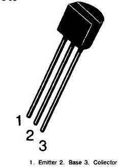

## 树莓派控制风扇java版本

### 材料：

1. 标准风扇 1个

2. 杜邦线4根 （2根公对母、2根母对母）

3. 树莓派4b 1个

   

4. S8050三极管 1个

   

---

### 接线

##### 三极管

* E:接风扇负极 (母对公杜邦线1根)
* B:接树莓派8号引脚 (母对母杜邦线1根)
* C:接树莓派6号引脚 (母对母杜邦线1根)

##### 风扇

* 正极接树莓派2号引脚 (母对公杜邦线1根)

---

#### 安装wiringpi

```shell
sudo apt-get install wiringpi //3b以前可以用这个？
```

#### 4b需要更新到最新版本

```shell
wget https://project-downloads.drogon.net/wiringpi-latest.deb
sudo dpkg -i wiringpi-latest.deb
```

----

### java相关

##### maven引入

```xml
<!-- https://mvnrepository.com/artifact/com.pi4j/pi4j-core -->
<dependency>
   <groupId>com.pi4j</groupId>
   <artifactId>pi4j-core</artifactId>
   <version>1.2</version>
</dependency>
```


##### 获取温度代码

```java
private Double getTemp() throws IOException {
      List<String> strings = Files.readAllLines(Paths.get("/sys/class/thermal/thermal_zone0/temp"));
      String tempString = String.join("", strings);
      Double temp = Double.valueOf(tempString) / 1000;
      return temp;
}
```

##### 控制gpio相关代码

```java
GpioPinDigitalOutput fan = GpioFactory.getInstance().provisionDigitalOutputPin(RaspiPin.GPIO_15, "fan", PinState.HIGH); //参考图例 8号引脚 为gpio15
fan.setState(false);//关
fan.setState(true);//开
```

